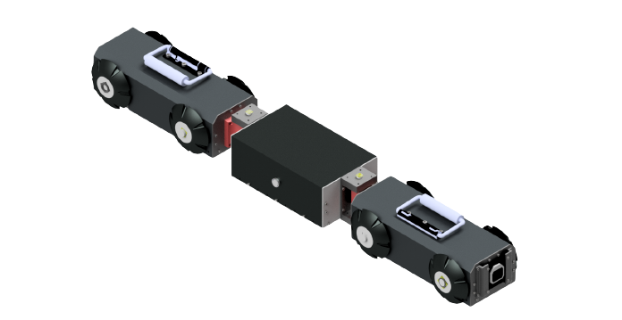

# Pypethon

# 🚧 Multi-Body Pipe Inspection Robot for Natural Gas Pipelines

**A robust and intelligent robotic system for defect detection and inspection in confined natural gas pipelines using deep learning and sensor fusion.**

---

## 🌍 Context & Importance

Natural gas plays a crucial role in everyday life, powering various household appliances and industrial equipment. According to:

- **Osinergmin (2021)**, the use of natural gas in Perú has increased by **4.3%** over the last 15 years.  
- **International Energy Agency (2024)**, global gas demand is expected to grow by **2.5%**, equivalent to **100 billion cubic meters**.

This high and increasing demand causes **constant usage of pipelines**, leading to both **internal and external defects**, such as:

- Corrosion  
- Deformation  
- Rust  
- Cracks  
- Abrasion  

Regular inspections are crucial to prevent gas leaks and ensure safety. However, traditional inspection methods using **ultrasound or radiography** are:

- **Time-consuming**  
- **Costly**  
- **Risky**  
- Often require **excavation** to reach pipelines

---

## ⚠️ Inspection Challenges

1. **Reduced internal diameter** of natural gas pipelines:
   - Common diameters: 4, 6, 8, 10, 12, 16, 20, and 24 inches  
   - Secondary ducts: up to 10 inches

2. **Elbow joints**: Make navigation more complex

3. **Explosive environments**: The robot must be **ATEX-compliant** and spark-free

---

## 🤖 The Robot – Pypethon

  
*Figure: Pypethon robot for internal pipe inspection.*

---

## 🔍 Related Work

Various inspection robots have been designed to tackle similar challenges:

- Adjustable robots for **8-10 inch pipes** [📄 pipe8in_1, pipe8in_2]  
- Miniature robots for **confined spaces** [📄 muy_peque]  
- Endoscopic robots for **gas and water pipelines** [📄 pipegas, pipegas2]  
- Robots with **corrosion and rust detection** using traditional computer vision [📄 robot_process_corrosion, robot_process_rust]

📈 **Trend toward CNN-based systems**:
- Traffic sign detection [📄 traffic]  
- Sugarcane field inspection [📄 sugarcane]  
- Multi-category object detection [📄 contour]  
- CNN-based barrel inspection [📄 robot_process_IA]  
- Gas leak detection using AI [📄 IA_inspection_gas]  
- Custom CNN for wastewater pipe anomalies [📄 cnn_anormal]

---

## 🎯 Project Objectives

This work proposes the development of a **multi-body robot** for internal inspection of **8-inch natural gas pipelines**, with the following key components:

- **Mechanical design** adapted for pipeline navigation  
- **Artificial vision system** using a **Convolutional Neural Network (CNN)** to detect internal defects like rust, corrosion, cracks, etc.  
- **Localization system** using **sensor fusion** (IMU + encoders) for precise positioning

---

## 🛠 Technologies & Tools

- **Python** with TensorFlow/PyTorch for deep learning  
- **Sensor fusion algorithms** (e.g., Kalman Filter)  
- **Mechanical CAD design** for robot body  
- Embedded systems (ESP32 / Arduino)

---

## 📁 Project Structure (example)

- **pipe-inspection-robot/**  
  - `src/`               - AI models and control code  
  - `hardware/`          - CAD and mechanical drawings  
  - `data/`              - Training datasets for defect detection  
  - `images/`            - Figures and visual documentation  
  - `docs/`              - Paper, presentations  
  - `README.md`          - Project overview


---

## 🤝 Contributions Welcome

Have ideas or want to improve the system? Feel free to fork the repo and submit a pull request.

---

## 📑 References

> You can cite this paper as follows:

### BibTeX Citation

```bibtex
@article{pypethon2025,
  title     = {Pypethon: A Multi-Body Robot for Inspection and Defect Detection in Natural Gas Pipelines},
  author    = {Your Name and Coauthor Name},
  journal   = {Journal of Intelligent Robotic Systems},
  year      = {2025},
  volume    = {XX},
  number    = {X},
  pages     = {1--12},
  doi       = {10.1234/jirs.pypethon2025},
  url       = {https://doi.org/10.1234/jirs.pypethon2025},
  publisher = {Springer}
}
